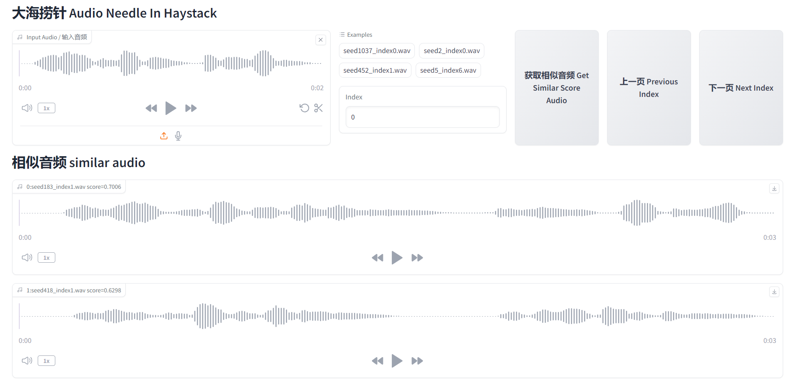

# Audio Needle In Haystack

[**English**](./README.md) | [**中文简体**](./README_CN.md)

## Project Introduction

In a large collection of audio, finding audio clips that closely match a target audio clip. Given a sufficient amount of audio data, there will always be a similar audio clip available.

Project Example: [HuggingFace Space](https://huggingface.co/spaces/omniway/Audio-Needle-In-Haystack)

Algorithm for matching audio: [speech_eres2netv2_sv_zh-cn_16k-common](https://www.modelscope.cn/models/iic/speech_eres2netv2_sv_zh-cn_16k-common/summary)



## Installation Dependencies

Install ffmpeg and libsox-dev:

```bash
sudo apt install ffmpeg libsox-dev
```

Install Python dependencies:

```bash
conda create -n 3ds python=3.9
conda activate 3ds

cd Audio-Speaker-Needle-In-Haystack
pip install -r requirements.txt
```

If you need to generate WAV files using ChatTTS, please follow the installation instructions of the related dependencies in the [2noise/ChatTTS](https://github.com/2noise/ChatTTS) project.

If you want to use pre-generated ChatTTS WAV files, you can access them at [Audio_speaker_needle_in_haystack](https://huggingface.co/datasets/omniway/Audio_speaker_needle_in_haystack).

## User Guide

Download the relevant audio files generated by ChatTTS and run the following commands:

```bash
python download_audios.py
python webui_speaker_needle_in_haystack.py
```

Alternatively, you can manually place the WAV files in the "audios" folder and run the command:

```bash
mkdir audios
python webui_speaker_needle_in_haystack.py
```

If you need help or want to reduce the batch size (if you don't have enough GPU memory), you can use the following commands:

```bash
python webui_speaker_needle_in_haystack.py --help
python webui_speaker_needle_in_haystack.py --batch_size=1
```

To generate audio using ChatTTS and save it in the "audios" folder, please refer to the relevant parameters in the `generate_audios_chattts.py` file:

```bash
cd Audio-Speaker-Needle-In-Haystack
git clone https://github.com/2noise/ChatTTS.git
python generate_audios_chattts.py
```

## References

- [speech_eres2netv2_sv_zh-cn_16k-common](https://www.modelscope.cn/models/iic/speech_eres2netv2_sv_zh-cn_16k-common/summary)
- [2noise/ChatTTS](https://github.com/2noise/ChatTTS)