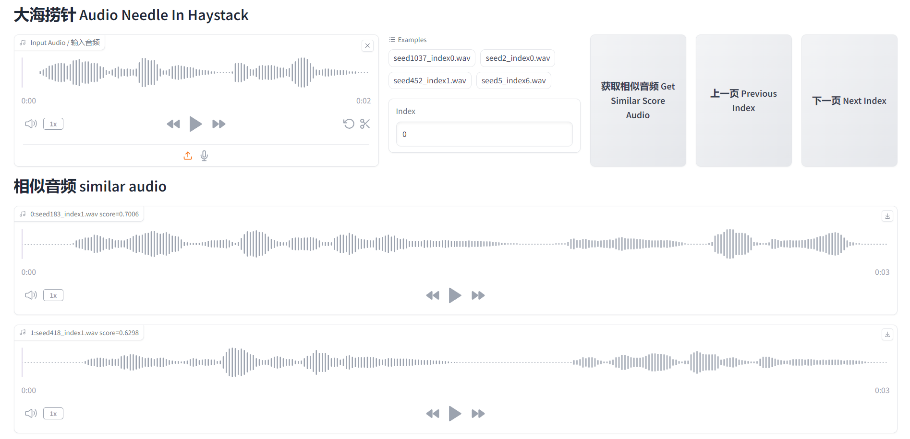

# Audio Speaker Needle In Haystack (音频大海捞针)

[**English**](./README.md) | [**中文简体**](./README_CN.md)

## 项目介绍

在大量音频中，匹配音色与目标音频较为相似的音频。如果音频是充分的，总能够找到一个类似的音频。

项目示例：[HuggingFace Space](https://huggingface.co/spaces/omniway/Audio-Needle-In-Haystack)

匹配音频的算法：[speech_eres2netv2_sv_zh-cn_16k-common](https://www.modelscope.cn/models/iic/speech_eres2netv2_sv_zh-cn_16k-common/summary)



## 安装依赖

安装ffmpeg和libsox-dev

```bash
sudo apt install ffmpeg libsox-dev
```

安装Python依赖

```bash
conda create -n 3ds python=3.9
conda activate 3ds

cd Audio-Speaker-Needle-In-Haystack
pip install -r requirements.txt
```

如果需要利用ChatTTS生成wav文件，请按照ChatTTS的相关依赖，参考[2noise/ChatTTS](https://github.com/2noise/ChatTTS)项目的安装方式。

如果需要使用预生成的ChatTTS的wav，可以访问[Audio_speaker_needle_in_haystack](https://huggingface.co/datasets/omniway/Audio_speaker_needle_in_haystack)获取。

## 运行指南

下载ChatTTS生成的相关音频并运行

```bash
python download_audios.py
python webui_speaker_needle_in_haystack.py
```

也可以手动窗口audios文件，将wav文件放置在audios文件夹中

```bash
mkdir audios
python webui_speaker_needle_in_haystack.py
```

查看帮助，或者降低batch_size（如果显存不够）

```bash
python webui_speaker_needle_in_haystack.py --help
python webui_speaker_needle_in_haystack.py --batch_size=1
```

通过ChatTTS自动生成audios文件夹中的音频，请阅读`generate_audios_chattts.py`文件中的相关参数进行配置。

```bash
cd Audio-Speaker-Needle-In-Haystack
git clone https://github.com/2noise/ChatTTS.git
python generate_audios_chattts.py
```

## References

- [speech_eres2netv2_sv_zh-cn_16k-common](https://www.modelscope.cn/models/iic/speech_eres2netv2_sv_zh-cn_16k-common/summary)
- [2noise/ChatTTS](https://github.com/2noise/ChatTTS)